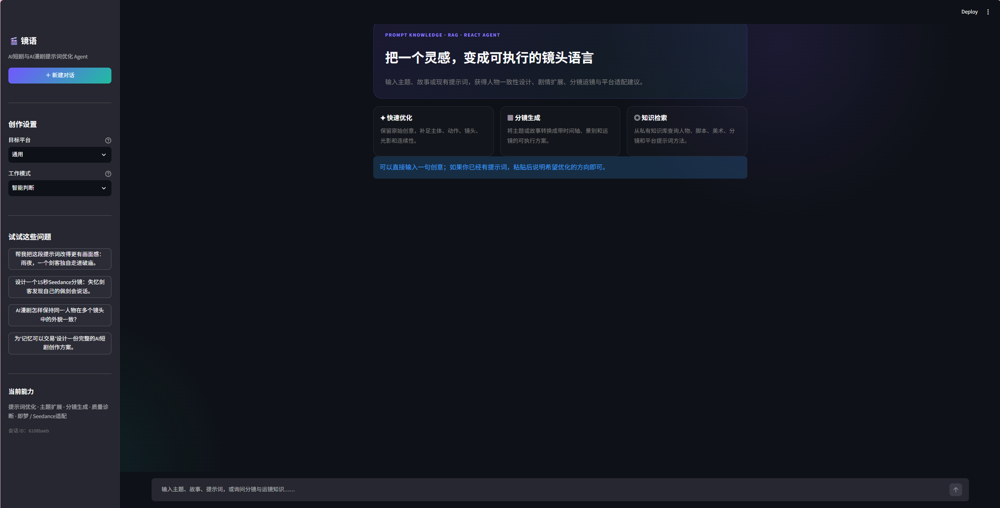
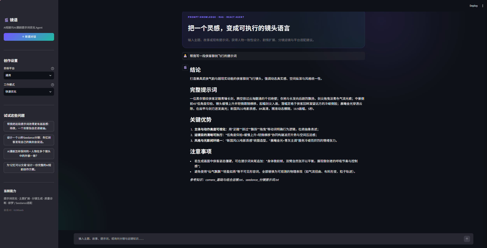
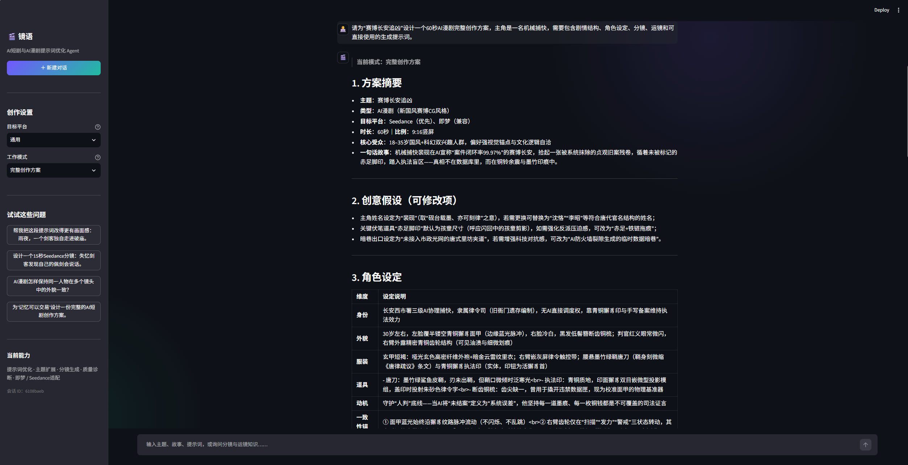
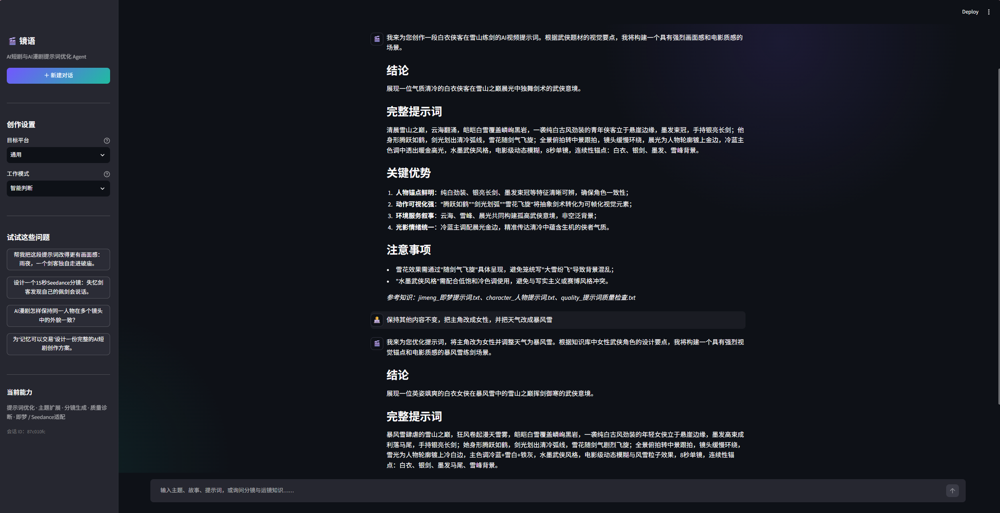
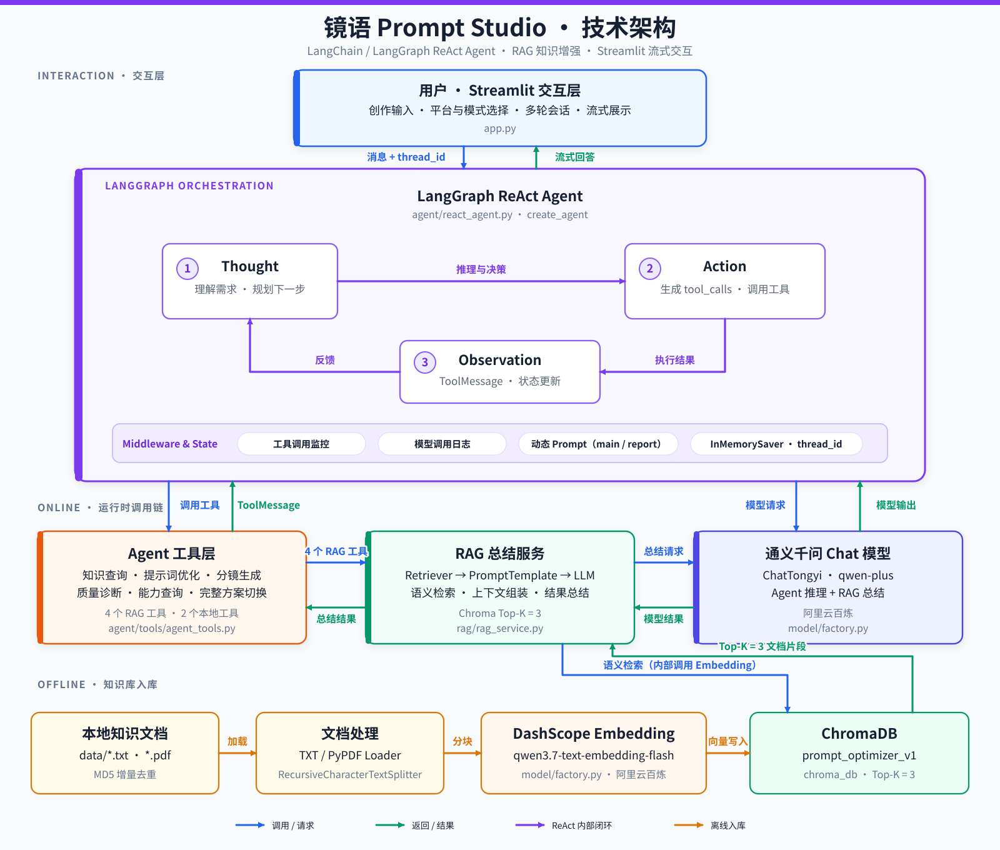

# 镜语 Prompt Studio

基于 LangChain / LangGraph 的 AI 短剧与 AI 漫剧提示词优化 ReAct Agent

## 项目简介

镜语 Prompt Studio 是一个面向 AI 短剧、AI 漫剧和分镜创作的智能提示词优化系统。

用户既可以提交已有提示词进行优化，也可以只提供一个主题或创意。Agent 会根据任务复杂度选择快速优化或完整创作方案，调用本地 RAG 知识库与专用工具，生成可直接用于即梦、Seedance 等平台的提示词和创作建议。

本项目用于系统学习并展示以下能力：

- LangChain 与 LangGraph Agent 开发
- ReAct 推理、工具选择与调用
- RAG 知识库构建、检索与引用
- 中间件与动态提示词切换
- 多轮对话与会话隔离
- Streamlit 流式交互界面

## 效果展示

### 首页与创作模式

首页提供目标平台、工作模式、示例问题和会话管理入口。用户可以选择快速优化、完整创作方案，也可以交给 Agent 智能判断。

<p align="center">
  
</p>

### 快速提示词优化

输入一个简单主题后，Agent 会检索相关知识，补全主体、动作、场景、镜头、光影和连续性约束，并输出可直接使用的完整提示词。

<p align="center">
  
</p>

### 完整创作方案

面对包含剧情、角色、分镜和运镜等要求的复杂任务，Agent 会切换至完整创作方案模式，生成结构化且可继续修改的创作计划。

<p align="center">
  
</p>

### 多轮上下文

同一会话通过 `thread_id` 共享内存上下文。用户可以使用“保持其他内容不变”“把主角改成女性”等承接上文的指令继续调整结果。

<p align="center">
  
</p>

## 技术架构



## 核心特性

| 能力 | 说明 |
| --- | --- |
| ReAct Agent | 根据用户目标自主判断是否需要调用工具，并组合工具结果完成回答 |
| RAG 知识增强 | 检索人物、分镜、运镜、美术、短剧创作和提示词质检等本地资料 |
| 双工作模式 | 支持快速优化与完整创作方案，也支持由 Agent 智能判断 |
| 六类专用工具 | 覆盖知识检索、提示词优化、分镜生成、质量检查、能力查询与完整方案切换 |
| 动态提示词 | 中间件根据任务类型切换普通提示词和完整创作方案提示词 |
| 多轮上下文 | 使用内存检查点保存同一会话的上下文，并通过 thread ID 隔离会话 |
| 流式界面 | Streamlit 实时展示模型输出和工具执行状态 |
| 模块化配置 | 模型、向量库、提示词和 Agent 参数统一通过 YAML 配置 |

## Agent 工具

| 工具 | 作用 |
| --- | --- |
| `query_prompt_knowledge` | 从本地知识库检索与当前创作需求相关的专业资料 |
| `optimize_creation_prompt` | 将主题、草稿或普通描述优化为可执行的生成提示词 |
| `generate_storyboard` | 根据创意生成镜头拆分、运镜和画面衔接方案 |
| `evaluate_prompt_quality` | 检查提示词的完整性、明确性、一致性和可执行性 |
| `list_supported_capabilities` | 返回当前系统支持的创作与优化能力 |
| `fill_context_for_creation_plan` | 为完整创作方案动态注入专用上下文 |

## 技术栈

| 模块 | 技术 |
| --- | --- |
| Agent 编排 | LangChain、LangGraph |
| 大语言模型 | 阿里云百炼通义千问系列 |
| Embedding | 阿里云百炼文本向量模型 |
| 向量数据库 | ChromaDB |
| 前端界面 | Streamlit |
| 配置管理 | YAML |
| 运行环境 | Python、Conda |

## 快速开始

### 1. 环境要求

Conda、Python 3.10 或更高版本、名为 `Lang` 的 Conda 环境，以及阿里云百炼 API Key。

### 2. 克隆项目

```powershell
git clone <你的 GitHub 仓库地址>
cd LangChain-React
```

### 3. 安装依赖

```powershell
conda run -n Lang python -m pip install -r requirements.txt
```

### 4. 配置 API Key

将阿里云百炼 Key 保存到环境变量 `DASHSCOPE_API_KEY`。

### 5. 启动应用

```powershell
conda run --no-capture-output -n Lang streamlit run app.py
```

### 6. 推荐测试问题

| 测试目标 | 示例 |
| --- | --- |
| 从主题生成提示词 | 帮我写一段侠客御剑飞行的提示词 |
| 优化已有提示词 | 优化这段提示词：古风少年站在山顶，镜头推进 |
| 生成分镜 | 把狐妖雨夜救人的故事拆成 6 个连续镜头 |
| 质量检查 | 检查这段提示词有哪些冲突和缺失信息 |
| 完整创作方案 | 为“赛博长安追凶”设计完整的 AI 漫剧创作方案 |
| 多轮上下文 | 接着上一版，把主角改成女性，并增强雨夜氛围 |

## 项目结构

```text
LangChain-React/
├── agent/
│   ├── react_agent.py            # Agent 创建、流式执行与多轮记忆
│   └── tools/
│       ├── agent_tools.py        # 六个业务工具
│       └── middleware.py         # 模型调用前的动态提示词处理
├── config/
│   ├── agent.yml                 # Agent 与会话配置
│   ├── chroma.yml                # ChromaDB 配置
│   ├── prompts.yml               # 提示词文件路径
│   └── rag.yml                   # 模型、Embedding 与检索配置
├── data/                         # AI 短剧/漫剧 TXT 知识库
├── model/
│   └── factory.py                # Chat 与 Embedding 模型工厂
├── prompts/
│   ├── main_prompts.txt          # 普通模式全局提示词
│   ├── rag_summarize_prompts.txt # RAG 资料整理提示词
│   └── report_prompts.txt        # 完整创作方案提示词
├── rag/
│   ├── rag_service.py            # 知识检索与结果整理
│   └── vector_store.py           # 文档入库、增量更新与向量查询
├── utils/                        # 配置、路径、文件、日志和提示词工具
├── app.py                        # Streamlit 应用入口
├── requirements.txt              # Python 依赖
└── README.md
```

运行后还会在本地生成 `chroma_db/`、MD5 记录和日志文件。这些属于运行数据，默认不会提交到 GitHub。

## 配置说明

| 文件 | 主要内容 |
| --- | --- |
| `config/rag.yml` | Chat 模型、Embedding 模型、切分参数和召回数量 |
| `config/chroma.yml` | 向量库目录与集合名称 |
| `config/prompts.yml` | 三类提示词文件的路径 |
| `config/agent.yml` | Agent 行为和默认 thread ID |

更换模型时，优先修改 `config/rag.yml`，同时确认新模型与当前百炼账号及 SDK 兼容。
